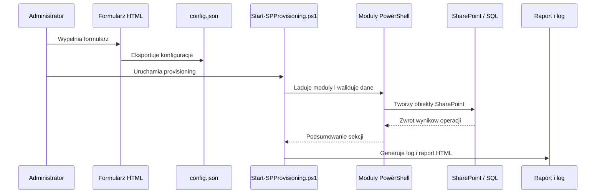

# Dokumentacja techniczna

## Cel rozwiązania

Framework służy do kontrolowanego provisioningu struktury SharePoint Subscription Edition na podstawie jednego pliku JSON wygenerowanego lokalnie z formularza HTML. Projekt oddziela etap przygotowania konfiguracji od etapu wykonania zmian w farmie SharePoint.

## Zakres funkcjonalny

- Tworzenie Web Application oraz użycie nowego albo istniejącego Application Pool.
- Tworzenie lub dobór Content Database dla Site Collection.
- Tworzenie Site Collections z obsługą `managedPath`.
- Rekurencyjne tworzenie podwitryn.
- Konfiguracja uprawnień i łamanie dziedziczenia.
- Tworzenie list i bibliotek.
- Rejestrowanie przebiegu sesji oraz generowanie raportu HTML.
- Generowanie dokumentacji DOCX bez zależności od Microsoft Word.

## Architektura logiczna

## Architektura komponentów

| Komponent | Typ | Odpowiedzialność |
| --- | --- | --- |
| `SP-Provisioning-Form.html` | Frontend statyczny | Budowa konfiguracji JSON, walidacja po stronie przeglądarki, podgląd danych |
| `Start-SPProvisioning.ps1` | Orchestrator | Inicjalizacja sesji, ładowanie modułów, walidacja, wywołanie provisioningu, raport końcowy |
| `Modules/SP-Logging.psm1` | Moduł wspólny | Log tekstowy, statystyki sesji, wpisy dla raportu HTML |
| `Modules/SP-Validation.psm1` | Moduł domenowy | Walidacja konfiguracji, środowiska, SQL, `managedPath`, kolizji i uprawnień uruchamiającego |
| `Modules/SP-WebApplication.psm1` | Moduł domenowy | Tworzenie Web Application, obsługa App Pool, administratorów i rollbacku WA |
| `Modules/SP-ContentDatabase.psm1` | Moduł domenowy | Tworzenie i dobór Content Database dla Site Collections |
| `Modules/SP-SiteCollection.psm1` | Moduł domenowy | Rozwiązywanie URL, `managedPath`, tworzenie Site Collections i administratorów SC |
| `Modules/SP-Subsites.psm1` | Moduł domenowy | Rekurencyjne tworzenie podwitryn na podstawie pełnych ścieżek URL |
| `Modules/SP-Permissions.psm1` | Moduł domenowy | Łamanie dziedziczenia, mapowanie ról, przypisania użytkowników i grup |
| `Modules/SP-Lists.psm1` | Moduł domenowy | Tworzenie list, bibliotek i ustawień wersjonowania |
| `Modules/SP-Reporting.psm1` | Moduł domenowy | Budowa samowystarczalnego raportu HTML |
| `Generate-Documentation.ps1` | Narzędzie pomocnicze | Generowanie dokumentacji DOCX w Open XML |
| `Run-GenerateDocumentation.ps1` | Wrapper | Obsługa UTF-8 BOM dla PowerShell 5.1 przy generacji DOCX |

## Struktura wykonania

### 1. Inicjalizacja

- Ustawiany jest `StrictMode`, `ErrorActionPreference` i `ProgressPreference`.
- Tworzone są kolekcje wyników sesji oraz lista obiektów do rollbacku.
- Ładowane są wszystkie moduły z katalogu `Modules/`.

### 2. Przygotowanie środowiska SharePoint

- Skrypt sprawdza, czy snapin `Microsoft.SharePoint.PowerShell` jest już załadowany.
- Jeżeli nie, próbuje użyć zarejestrowanego snapina.
- W kolejnym kroku podejmuje próbę załadowania środowiska SharePoint z pliku `SharePoint.ps1`.
- W `DryRun` brak snapina nie blokuje dalszej symulacji. W `Execute` jest błędem krytycznym.

### 3. Odczyt konfiguracji

- JSON jest czytany z `UTF8`.
- Obiekt `PSCustomObject` jest konwertowany do `hashtable`, bo na takim modelu pracują moduły.

### 4. Walidacja

Walidacja obejmuje:

- sekcję `webApplication`
- sekcję `applicationPool`
- sekcję `sqlServer`
- sekcję `siteCollections`
- rekurencyjną walidację `subsites`
- kolizje istniejących obiektów SharePoint
- uprawnienia uruchamiającego

Warto pamiętać:

- `DryRun` pomija część testów wykonywanych tylko w trybie pełnym, między innymi test połączenia z SQL i sprawdzenie istniejących obiektów farmy.
- Błędy blokują provisioning.
- Ostrzeżenia pozwalają kontynuować, ale są zapisywane w logu i raporcie.

## Model konfiguracji JSON

### Sekcje główne

| Sekcja | Znaczenie |
| --- | --- |
| `metadata` | Wersja formatu, data wygenerowania, nazwa narzędzia |
| `webApplication` | Parametry Web Application, URL, port, auth, limity |
| `applicationPool` | Nazwa App Pool, tryb `new/existing`, konto |
| `sqlServer` | Serwer SQL, instancja, główna Content Database |
| `siteCollections` | Lista kolekcji witryn wraz z listami, uprawnieniami i podwitrynami |

### `webApplication`

Najważniejsze pola:

- `name`
- `url`
- `port`
- `hostHeader`
- `authType`
- `zone`
- `storageLimit`
- `versionLimit`
- `administrators`

Walidacja sprawdza m.in. format URL, zakres portu oraz dozwolone typy uwierzytelniania: `NTLM`, `Kerberos`, `Claims`.

### `applicationPool`

Najważniejsze pola:

- `name`
- `mode`
- `account`
- `passwordSecured`

Istotna uwaga techniczna:

> `passwordSecured` nie przenosi rzeczywistego hasła do runtime. W praktyce jest znacznikiem z formularza. Gdy `mode = "new"`, skrypt oczekuje, że konto z pola `account` jest już zarejestrowanym Managed Account w SharePoint.

### `sqlServer`

Najważniejsze pola:

- `server`
- `instance`
- `contentDatabase`
- `authMode`
- `dbSizeLimit`
- `rowWarningLimit`
- `useFailover`
- `failoverServer`

### `siteCollections`

Każda kolekcja zawiera m.in.:

- `title`
- `url`
- `managedPath`
- `managedPathType`
- `template`
- `language`
- `ownerAlias`
- `secondaryOwnerAlias`
- `admins`
- `permissions`
- `separateDatabase`
- `contentDatabase`
- `dbServer`
- `lists`
- `subsites`

### Zasady `managedPathType`

| Wariant | Znaczenie | Przykład wyniku |
| --- | --- | --- |
| `auto` | Typ wyliczany na podstawie `managedPath` i `url` | `/sites/projekty` albo `/portals` |
| `wildcard` | Wymaga pojedynczego segmentu `url` | `http://host/sites/projekty` |
| `explicit` | Nie używa dodatkowego `url` poza samym managed path | `http://host/portals` |

### Model podwitryn

Podwitryny są definiowane rekurencyjnie. Ważna reguła implementacyjna:

> `subsite.url` jest pełną ścieżką od korzenia Site Collection, a nie wyłącznie nazwą segmentu potomnego. Przykład poprawny: `/it/helpdesk`.

## Reguły biznesowe i ograniczenia

| Reguła | Skutek w rozwiązaniu |
| --- | --- |
| Jedna osobna Content Database może być przypisana tylko do Site Collection | Konfiguracja podwitryny z osobną DB daje ostrzeżenie i jest ignorowana |
| Root Site Collection wymaga `managedPath = "/"` i `url = "/"` | Walidator blokuje błędny układ |
| Wildcard Managed Path wymaga pojedynczego segmentu `url` | Walidator blokuje wielopoziomowe ścieżki w `siteCollections[].url` |
| `inheritPermissions = false` bez wpisów uprawnień | System zgłasza ostrzeżenie o ryzyku niedostępnej witryny |
| Nowy App Pool wymaga Managed Account | Brak konta w farmie kończy etap WA błędem |
| Główny skrypt musi działać jako administrator lokalny | Walidacja traktuje brak uprawnień jako błąd |

## Przebieg provisioningu

### Faza 1: Walidacja

- `Invoke-SPValidation`
- sprawdzanie konfiguracji i środowiska
- zatrzymanie procesu przy błędach

### Faza 2: Web Application

- `New-SPWebApplicationProvisioned`
- decyzja: istniejący albo nowy App Pool
- przypisanie administratorów WA
- konfiguracja podstawowych limitów
- wyłączenie `Self-Service Site Creation`

### Faza 3: Site Collections i hierarchia

Dla każdej Site Collection wykonywane są kolejne kroki:

1. Dobór lub utworzenie Content Database.
2. Rozwiązanie docelowego URL i `managedPath`.
3. Utworzenie Site Collection.
4. Dodatkowi administratorzy SC.
5. Uprawnienia na Root Web.
6. Listy i biblioteki na Root Web.
7. Rekurencyjne tworzenie podwitryn.

### Faza 4: Raportowanie

- pobranie statystyk sesji
- pobranie wszystkich wpisów logu
- wygenerowanie raportu HTML
- zamknięcie logu tekstowego

## Rollback i obsługa błędów

Mechanizm rollbacku rejestruje utworzone obiekty jako listę:

- typ
- nazwa
- URL
- akcja rollbacku
- data rejestracji

Rollback działa w odwrotnej kolejności tworzenia obiektów.

Najważniejsze zachowania:

- błąd krytyczny przy tworzeniu Web Application uruchamia globalny rollback
- błąd krytyczny w fazie Site Collections również uruchamia rollback
- jeśli utworzono dedykowaną Content Database, a Site Collection nie powstała, skrypt usuwa osieroconą bazę
- rollback Web Application usuwa aplikację web i IIS site, ale nie usuwa automatycznie bazy SQL

## Logowanie i raport HTML

### Log tekstowy

Moduł `SP-Logging.psm1` odpowiada za:

- tworzenie pliku `SP_Provisioning_yyyyMMdd_HHmmss.log`
- poziomy: `DEBUG`, `INFO`, `WARNING`, `ERROR`, `SUCCESS`
- liczniki błędów i ostrzeżeń
- bufor wpisów do raportu HTML

### Raport HTML

Moduł `SP-Reporting.psm1` generuje:

- status sesji
- karty podsumowujące
- sekcje per obszar: WA, DB, Site Collections, Subsites, Permissions, Lists
- tabelę pełnego logu
- kompletne style osadzone lokalnie w jednym pliku HTML

## Formularz HTML

Formularz `SP-Provisioning-Form.html` nie komunikuje się bezpośrednio z SharePoint. Jego zadaniem jest:

- zbudowanie konfiguracji
- podgląd JSON
- eksport pliku
- walidacja po stronie klienta
- obsługa kolekcji witryn w układzie kart
- obsługa drzewa podwitryn z modalem edycji

Ważne cechy implementacyjne formularza:

- wspiera `managedPathType`
- rozróżnia listy na poziomie SC i podwitryn
- potrafi zbudować wielopoziomową strukturę z pełnymi ścieżkami URL
- zawiera wbudowaną przykładową konfigurację

## Lista wspieranych typów list

Moduł `SP-Lists.psm1` mapuje co najmniej poniższe `templateType`:

| ID | Typ |
| --- | --- |
| `100` | Lista niestandardowa |
| `101` | Biblioteka dokumentów |
| `105` | Kontakty |
| `106` | Kalendarz |
| `107` | Zadania |
| `108` | Dyskusje |
| `109` | Obrazy |
| `150` | Strony witryny |
| `200` | Ogłoszenia |
| `1100` | Aktywa |

## Role i uprawnienia

Mapowanie ról w `SP-Permissions.psm1` obejmuje:

- `Full Control`
- `Design`
- `Edit`
- `Contribute`
- `Read`
- `View Only`
- `Guest`

Typy podmiotów bezpieczeństwa:

- `User`
- `Group`
- `SPGroup`

W przypadku `SPGroup` moduł może utworzyć grupę SharePoint, jeśli jeszcze nie istnieje.

## Artefakty wyjściowe

| Artefakt | Lokalizacja domyślna | Cel |
| --- | --- | --- |
| Log tekstowy | `Logs/` | diagnostyka i audyt sesji |
| Raport HTML | `Logs/` | podsumowanie wykonania dla administratora |
| Dokumentacja DOCX | katalog główny repozytorium | dokument wdrożeniowy i techniczny |

## Rozszerzanie rozwiązania

Najbezpieczniejsze punkty rozbudowy:

- nowe typy list w `SP-Lists.psm1`
- dodatkowe role albo strategie mapowania w `SP-Permissions.psm1`
- nowe reguły walidacji w `SP-Validation.psm1`
- dodatkowe sekcje raportu w `SP-Reporting.psm1`
- nowe pola formularza HTML i odpowiadające im pola w JSON

## Ryzyka utrzymaniowe

- Rozwiązanie jest ściśle związane z Windows PowerShell 5.1 i modelem SharePoint on-premise.
- Runtime zależy od dostępności snapina albo skryptu rejestrującego środowisko SharePoint.
- Błędy w szablonach witryn lub brak Managed Account pojawią się dopiero na etapie wykonania w farmie.
- `DryRun` jest bezpieczny, ale nie zastępuje pełnej walidacji środowiska produkcyjnego.
