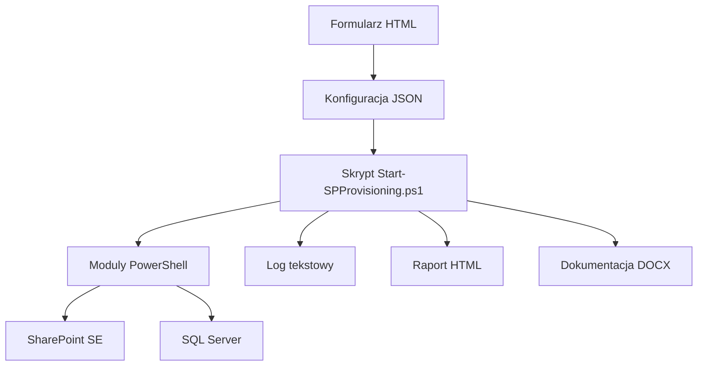

# SharePoint Provisioning Framework - Wiki

Ta wiki została przygotowana jako gotowy zestaw stron do repozytorium GitHub i do natywnej GitHub Wiki.

## Start tutaj

- [Dokumentacja techniczna](./Dokumentacja-techniczna.md)
- [Uruchomienie i diagnostyka](./Uruchomienie-i-diagnostyka.md)

## O czym jest ta dokumentacja

- Opisuje architekturę rozwiązania HTML + PowerShell dla SharePoint Subscription Edition.
- Wyjaśnia model konfiguracji JSON, przebieg provisioningu i odpowiedzialności modułów.
- Zawiera wskazówki operacyjne, checklisty, diagnostykę i typowe problemy.

## Mapa rozwiązania

## Najważniejsze obszary

| Obszar | Co opisuje |
| --- | --- |
| Architektura | Komponenty, zależności, przepływ danych, punkty wejścia |
| Runtime | Walidacja, `DryRun`, `Execute`, rollback, raportowanie |
| Konfiguracja | Sekcje JSON, `managedPathType`, Site Collections, Subsites |
| Operacje | Uruchomienie, checklisty, logi, diagnostyka i typowe błędy |

## Przydatne pliki w repozytorium

| Plik | Rola |
| --- | --- |
| `SP-Provisioning-Form.html` | Generator konfiguracji JSON |
| `Start-SPProvisioning.ps1` | Główny orchestrator provisioningu |
| `Modules/*.psm1` | Moduły domenowe PowerShell |
| `config-example.json` | Przykładowa konfiguracja wejściowa |
| `Generate-Documentation.ps1` | Generator dokumentacji DOCX |
| `Run-GenerateDocumentation.ps1` | Wrapper UTF-8 BOM dla PowerShell 5.1 |

## Uwagi praktyczne

> Jeśli te pliki mają zostać przeniesione do natywnej GitHub Wiki, zachowaj nazwy `Home.md` i `_Sidebar.md`. Dzięki temu strona główna i nawigacja zadziałają od razu.

Materiały powiązane w repozytorium głównym:

- `README.md`
- `README-Architektura.md`
